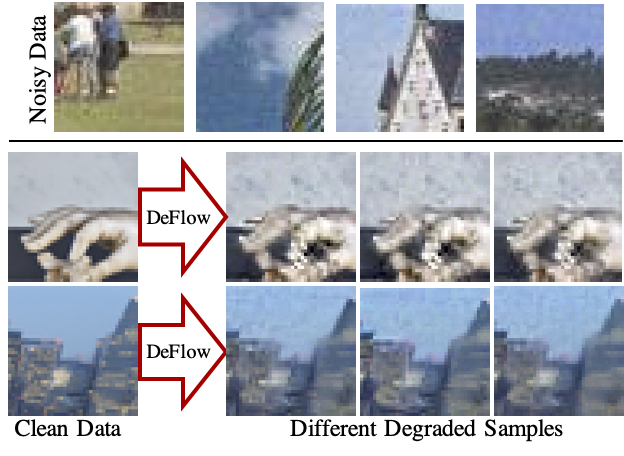

# DeFlow: Learning Complex Image Degradations from Unpaired Data with Conditional Flows
Official implementation of the paper *DeFlow: Learning Complex Image Degradations from Unpaired Data with Conditional Flows*  

[[Paper] CVPR 2021 Oral](https://arxiv.org/abs/2101.05796)

<p align="center">
  
</p>

## Setup and Installation
```bash
# create and activate new conda environment
conda create --name DeFlow python=3.7.9
conda activate DeFlow

# install pytorch 1.6 (untested with different versions)
conda install pytorch==1.6.0 torchvision==0.7.0 cudatoolkit=10.1 -c pytorch
# install required packages
pip install pyyaml imageio natsort opencv-python scikit-image tqdm jupyter psutil tensorboard

# clone the repository
git clone https://github.com/volflow/DeFlow.git
cd ./DeFlow/
```

## Dataset Preparation
We provide bash scripts that download and prepare the AIM-RWSR, NTIRE-RWSR, and DPED-RWSR datasets.
The script generates all the downsampled images required by DeFlow in advance for faster training. 


**Validation datasets**  
```bash
cd ./datasets
bash get-AIM-RWSR-val.sh 
bash get-NTIRE-RWSR-val.sh 
```

**Training datasets**  
```bash
cd ./datasets
bash get-AIM-RWSR-train.sh 
bash get-NTIRE-RWSR-train.sh 
```

**DPED dataset**  
For the DPED-RWSR dataset, we followed the approach of https://github.com/jixiaozhong/RealSR and used KernelGAN https://github.com/sefibk/KernelGAN to estimate and apply blur kernels to the downsampled high-quality images.
DeFlow is then trained with these blurred images.
More detailed instructions on this will be added here soon.

## Trained Models
**DeFlow Models**  
To download the trained DeFlow models run:
```bash
cd ./trained_models/
bash get-DeFlow-models.sh 
```

**Pretrained RRDB models**  
To download the pretrained RRDB models used for training run:
```bash
cd ./trained_models/
bash get-RRDB-models.sh 
```

**ESRGAN Models**  
The ESRGAN models trained with degradations generated by DeFlow will be made available for download here soon.

## Validate Pretrained Models
1. Download and prepare the corresponding validation datasets (see above)
2. Download the pretrained DeFlow models (see above)
3. Run the below codes to validate the model on the images of the validation set:
```bash
cd ./codes
CUDA_VISIBLE_DEVICES=-1 python validate.py -opt DeFlow-AIM-RWSR.yml -model_path ../trained_models/DeFlow_models/DeFlow-AIM-RWSR-100k.pth -crop_size 256 -n_max 5;
CUDA_VISIBLE_DEVICES=-1 python validate.py -opt DeFlow-NTIRE-RWSR.yml -model_path ../trained_models/DeFlow_models/DeFlow-NTIRE-RWSR-100k.pth -crop_size 256 -n_max 5;
```

If your GPU has enough memory or `-crop_size` is set small enough you can remove `CUDA_VISIBLE_DEVICES=-1` from the above commands to run the validation on your GPU.

The resulting images are saved to a subfolder in `./results/` which again contains four subfolders:
- `/0_to_1/` contains images from domain X (clean) translated to domain Y (noisy). This adds the synthetic degradations
- `/1_to_0/` contains images from domain Y (noisy) translated to domain X (clean). This reverses the degradation model and shows some denoising performance
- `/0_gen/` and the `/1_gen/` folders contain samples from the conditional distributions p_X(x|h(x)) and p_Y(x|h(x)), respectively

## Generate Synthetic Dataset for Downstream Tasks
To apply the DeFlow degradation model to a folder of high-quality images use the `translate.py` script.
For example to generate the degraded low-resolution images for the AIM-RWSR dataset that we used to train our ESRGAN model run:
```bash
## download dataset if not already done
# cd ./datasets
# bash get-AIM-RWSR-train.sh
# cd ..
cd ./codes
CUDA_VISIBLE_DEVICES=-1 python translate.py -opt DeFlow-AIM-RWSR.yml -model_path ../trained_models/DeFlow_models/DeFlow-AIM-RWSR-100k.pth -source_dir ../datasets/AIM-RWSR/train-clean-images/4x/ -out_dir ../datasets/AIM-RWSR/train-clean-images/4x_degraded/
```

**Training the downstream ESRGAN models**  
We used the training pipeline from https://github.com/jixiaozhong/RealSR to train our ESRGAN models trained on the high-resolution `/1x/` and low-resolution `/4x_degraded/` data.
The trained ESRGAN models and more details on how to reproduce them will be added here soon.

## Training DeFlow
1. Download and prepare the corresponding training datasets (see above)
2. Download and prepare the corresponding validation datasets (see above)
3. Download the pretrained RRDB models (see above)
4. Run the provided `train.py` script with the corresponding configs
```bash
cd code
python train.py -opt ./confs/DeFlow-AIM-RWSR.yml
python train.py -opt ./confs/DeFlow-NTIRE-RWSR.yml
```

If you run out of GPU memory you can reduce the batch size or the patch size in the config files.
To train without a GPU prefix the commands with `CUDA_VISIBLE_DEVICES=-1`.

Instructions for training DeFlow on the DPED dataset will be added here soon.

To train DeFlow on other datasets simply create your own config file and change the dataset paths accordingly.
To pre-generate the downsampled images that are used as conditional features by DeFlow you can use the `./datasets/create_DeFlow_train_dataset.py` script.

## Citation
[[Paper] CVPR 2021 Oral](https://arxiv.org/abs/2101.05796)
```
@inproceedings{wolf2021deflow,
    author    = {Valentin Wolf and
                Andreas Lugmayr and
                Martin Danelljan and
                Luc Van Gool and
                Radu Timofte},
    title     = {DeFlow: Learning Complex Image Degradations from Unpaired Data with Conditional Flows},
    booktitle = {{IEEE/CVF} Conference on Computer Vision and Pattern Recognition, {CVPR}},
    year      = {2021},
    url       = {https://arxiv.org/abs/2101.05796}
}
```

